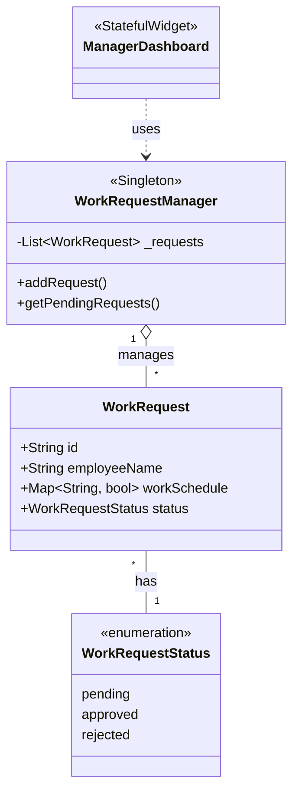

# 1- שער פתיחה (صفحة الغلاف)

**الاسم :** [اسمك الكامل]

**رقم هوية :** [رقم الهوية الخاص بك]

**اسم المعلم :** أنس عنبوسي

**اسم المدرسة :** مدرسة يمة الزراعية

**اسم المشروع :** تطبيق إدارة جداول العمال والطلبات (Workers Schedule Manager)

**اسم المسار:** تخصص برمجة الهواتف الذكية

**تاريخ التسليم:** [تاريخ التسليم]

---

# 2- תוכן עניינים (الفهرس)

*ملاحظة: يمكنك إنشاء الفهرس تلقائياً في Google Docs من خلال الرابط المرفق: [كيفية إنشاء فهرس تلقائي](https://www.youtube.com/watch?v=okTs0k1P6RA)*

| כותרת (العنوان) | מספר העמוד (رقم الصفحة) |
| :--- | :--- |
| מבוא (المقدمة) | 3 |
| דרישות מערכת (متطلبات النظام) | 4 |
| מדריך למשתמש (دليل المستخدم) | 5 |
| מבנה, ארכטיקטורה של הפרויקט (هيكل المشروع) | 6 |
| בסיס נתונים (قاعدة البيانات) | 7 |
| מימוש הפרויקט (تنفيذ المشروع والكود) | 8 |
| סיכום אישי/רפלקציה (تلخيص شخصي) | 9 |
| נספחים (الملاحق) | 10 |

---

# 3- מבוא (المقدمة والأهداف)

**מטרה, יעדים, מהות המערכת:**
يهدف هذا المشروع إلى تطوير نظام متكامل على الهواتف الذكية لتسهيل التواصل وإدارة جداول العمل بين الموظفين (العمال) والمديرين. يسمح التطبيق للعمال بتسجيل الدخول، إرسال طلبات أيام العمل أو الإجازات، وتتبع ساعات العمل الخاصة بهم. في المقابل، توفر لوحة تحكم المدير (Manager Dashboard) القدرة على عرض طلبات العمال، الموافقة عليها أو رفضها، ومراجعة الجداول الأسبوعية بوضوح.

**עיצוב מסכים והנדסת אנוש (تصميم الشاشات وتجربة المستخدم):**
تم بناء واجهات المستخدم باستخدام إطار عمل Flutter لضمان تصميم مرن وسلس (Responsive)، مع التركيز على توفير تجربة مستخدم (UX) مريحة. تم اعتماد ألوان جذابة وتدرجات لونية (Gradients) بالإضافة إلى الرسوم المتحركة (Animations) وتأثيرات بصرية مميزة في لوحة المدير لتسهيل تمييز الطلبات المعلقة عن المعتمدة بطريقة هندسة بشرية (Ergonomics) مدروسة لتجنب إجهاد المستخدم.

---

# 4- דרישות מערכת (متطلبات النظام)

لتشغيل هذا التطبيق وتطويره بشكل سليم، يجب توافر المتطلبات الأساسية التالية، وتشمل صلاحيات الوصول (הרשאות) ومكونات النظام:

1. מערכת הפעלה אנדרויד מעל גרסה 13 (نظام تشغيل أندرويد إصدار 13 فما فوق).
2. מכשיר אנדרויד אמיתי (جهاز أندرويد حقيقي لاختبار المستشعرات وتسجيل الدخول الاجتماعي).
3. חיבור המכשיר לאינטרנט (اتصال بشبكة الإنترنت للاتصال بقاعدة البيانات).
4. מסד הנתונים של גוגל בענן FireStore (قاعدة بيانات Firebase Firestore لتخزين ومزامنة البيانات).
5. Android Studio (بيئة التطوير).
6. Flutter SDK (مجموعة أدوات تطوير فلاتر).
7. flutter plugin in Android studio.
8. dart plugin in Android studio.

**הרשאות (الصلاحيات):**
- صلاحية الوصول إلى الإنترنت (Internet).
- صلاحية استخدام تقنيات المصادقة (Google Sign-In, Facebook Login, Apple Sign-In).

---

# 5- מדריך למשתמש (دليل المستخدم)

**דיאגרמת מסכים ומעבר ביניהם (تخطيط UML للصفحات):**
*(يرجى إضافة صورة المخطط هنا باستخدام app.diagrams.net توضح الانتقال من شاشة الدخول -> الشاشة الرئيسية -> لوحة المدير / صفحات التتبع)*

**מדריך ברור למשתמש (دليل الاستخدام):**

1. **מסך התחברות (Login Screen):**
   - **תפקיד:** تسجيل دخول المستخدم.
   - **כפתורים:** حقول البريد وكلمة المرور، أزرار تسجيل الدخول الاجتماعي (Google, Facebook, Apple). 
   - *(ضع صورة لشاشة تسجيل الدخول هنا)*

2. **מסך הרשמה (Sign Up Screen):**
   - **תפקיד:** إنشاء حساب جديد للمستخدمين والعمال.
   - *(ضع صورة لشاشة التسجيل هنا)*

3. **מסך לוח הבקרה למנהל (Manager Dashboard):**
   - **תפקיד:** عرض الطلبات المعلقة والمعتمدة للمدير.
   - **כפתורים:** تبويبات (Tabs) للانتقال بين "الطلبات المعلقة" و"الطلبات المعتمدة". أزرار (اعتماد، رفض، تفاصيل) لكل طلب.
   - *(ضع صورة للوحة المدير هنا)*

4. **מסך מעקב זמנים ולוח שבועי (Time Tracking & Weekly Schedule):**
   - **תפקיד:** تمكين العامل من تحديد أيام العمل وإرسالها للمدير.

*(ملاحظة: يمكنك إرفاق رابط فيديو يشرح آلية عمل التطبيق هنا).*

---

# 6- מבנה, ארכטיקטורה של הפרויקט (هيكل المشروع)

يعتمد التطبيق على بنية برمجية منظمة تفصل بين واجهات المستخدم (Views) والمنطق البرمجي ونماذج البيانات (Models).

**תיאור ארכיטקטורה - תרשים מחלקות (مخطط الكلاسات):**
يوضح هذا المخطط العلاقات بين نماذج البيانات والشاشات:

**ארגון הקבצים (تنظيم الملفات):**
- `lib/views/`: يحتوي على جميع شاشات التطبيق (مثل `LoginScreen.dart`, `Manager/Dashboard.dart`).
- `lib/Utils/`: يحتوي على الملفات المساعدة والوظائف العامة.

---

# 7- בסיס נתונים - database

**תיאור ארגון הנתונים (وصف تنظيم البيانات):**
تم اختيار **Firebase Firestore** كقاعدة بيانات NoSQL سحابية. يتم تخزين البيانات على شكل Collections و Documents.

**טבלאות / קולקשנים (المجموعات والأمثلة):**

1. **Users Collection (مجموعة المستخدمين):**
   - `uid` (String)
   - `email` (String)
   - `role` (String) - لتحديد ما إذا كان المستخدم مديراً أم عاملاً.

2. **WorkRequests Collection (مجموعة الطلبات):**
   - `id`: المعرف الفريد للطلب.
   - `employeeName`: اسم الموظف.
   - `workSchedule`: خريطة (Map) تحتوي على أيام الأسبوع كـ Key، وقيمة بوليانية (True/False) تحدد إن كان يوم عمل أم لا.
   - `status`: حالة الطلب (معلق، مقبول، مرفوض).

---

# 8- מימוש הפרויקט (تنفيذ المشروع، الكود، والاختبارات)

تم تطبيق مبادئ **התכנות מונחה עצמים (OOP)** بشكل كامل. تم فصل الـ Logic (المنطق) عن الـ Graphics (الرسوميات) لتسهيل صيانة النظام.

**המחלקות המרכזיות (الكلاسات الرئيسية التي تم بناؤها):**

1. **מחלקה `WorkRequestManager`:**
   - **תפקיד:** إدارة الطلبات في التطبيق. تعتمد على نمط **Singleton** لضمان وجود نسخة واحدة فقط تتعامل مع البيانات في الذاكرة.
   - **פעולות (الدوال):** `addRequest()` لإضافة طلب جديد، و `getPendingRequests()` لجلب الطلبات التي تنتظر موافقة المدير.

2. **מחלקה `WorkRequest`:**
   - **תפקיד:** تمثيل بيانات طلب العمل الخاص بالموظف (Data Model).
   - **משתנים:** `id` (رقم الطلب)، `employeeName` (اسم الموظف)، `workSchedule` (جدول العمل).

3. **מחלקת UI `ManagerDashboard` (אקטיביטי/מסך):**
   - **תפקיד:** واجهة عرض طلبات العمال للمدير.
   - **מימוש (التنفيذ):** تستخدم عناصر State (الحالة) والتأثيرات الحركية (AnimationControllers) لتقديم عرض جذاب. تستدعي دوال من `WorkRequestManager` لتغيير حالات الطلب بين اعتماد ورفض.

---

# 9- סיכום אישי/רפלקציה (تلخيص شخصي / تأملات)

*ملاحظة: يجب صياغة هذا القسم بأسلوبك الشخصي.*

**مثال للتلخيص:**
خلال بناء هذا المشروع، واجهت تحديات حقيقية في كيفية دمج أنظمة المصادقة المختلفة (Firebase Authentication) وتأمين تدفق بيانات سلس بين العمال والمدير في الوقت الفعلي (Real-time). لقد تعلمت الكثير عن معمارية تطبيقات الهواتف الذكية وكيفية تصميم واجهة مستخدم لا تبدو جيدة فحسب، بل سهلة الاستخدام أيضاً (UI/UX). 
من نقاط قوة المشروع تنظيمه وفصله للمنطق عن التصميم (Separation of Concerns). كخطوات مستقبلية، أطمح لإضافة إشعارات فورية (Push Notifications) لتنبيه العمال حين يوافق المدير على طلباتهم، وتوليد تقارير شهرية بصيغة PDF لرواتب العمال.

---

# 10- נספחים (الملاحق)

**קוד מקור (نص الكود المصدري):**
*(في هذا القسم، ستقوم بنسخ ولصق بعض الأكواد المهمة من ملفاتك مثل جزء من كود تسجيل الدخول أو الـ WorkRequestManager مع توضيح التعليقات عليها).*

**קישור גיטהאב (رابط Github):**
[ضع رابط مستودع الـ GitHub الخاص بك هنا]
https://github.com/[Username]/[Repo-Name]
